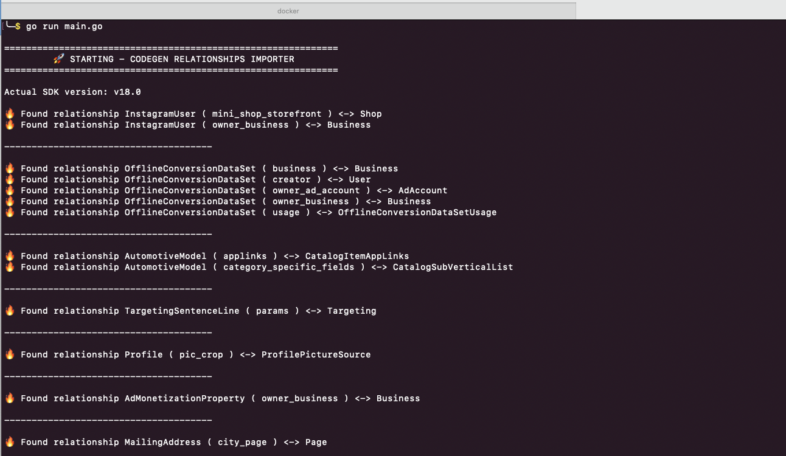
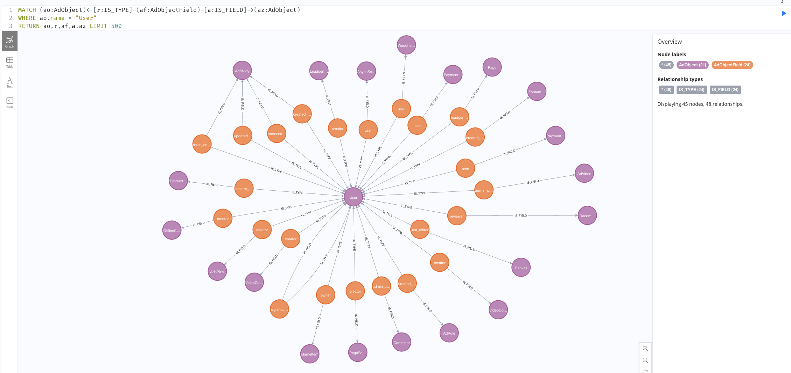

# Facebook Business SDK Codegen Relationships

Explore relationships between AdObjects in the Facebook Business SDK.

## Getting Started

### Prerequisites

- Git
- Golang 1.20+
- Docker 

### Start the Neo4j Database

```bash
  docker compose up
```

### Run the Codegen

```bash
  go run main.go
```


### Explore the Graph

Open the Neo4j Browser at http://localhost:7474/browser/ ( No Auth ) and run the following query:

### Get all AdObjects Linked to a another AdObject

Get all relationships from the AdObject `User` to other AdObjects.

```cypher
    MATCH (ao:AdObject)<-[t:IS_TYPE]-(af:AdObjectField)-[f:IS_FIELD]->(aoo:AdObject)
    WHERE ao.name = "User"
    RETURN ao,t,af,f,aoo
```

In this example we can see that `User` is connected to `AdsPixel` via the field `creator` in `AdsPixel`



### Todo 

- [X] Direct Links between AdObjects
- [ ] Link between AdObjects via numeric string fields ( ex : `Ad` -> `account_id` -> `AdAccount` )

# License

The MIT License

Copyright (c) 2023 JUST1B

Permission is hereby granted, free of charge, to any person obtaining a copy of this software and associated documentation files (the "Software"), to deal in the Software without restriction, including without limitation the rights to use, copy, modify, merge, publish, distribute, sublicense, and/or sell copies of the Software, and to permit persons to whom the Software is furnished to do so, subject to the following conditions:

The above copyright notice and this permission notice shall be included in all copies or substantial portions of the Software.

THE SOFTWARE IS PROVIDED "AS IS", WITHOUT WARRANTY OF ANY KIND, EXPRESS OR IMPLIED, INCLUDING BUT NOT LIMITED TO THE WARRANTIES OF MERCHANTABILITY, FITNESS FOR A PARTICULAR PURPOSE AND NONINFRINGEMENT. IN NO EVENT SHALL THE AUTHORS OR COPYRIGHT HOLDERS BE LIABLE FOR ANY CLAIM, DAMAGES OR OTHER LIABILITY, WHETHER IN AN ACTION OF CONTRACT, TORT OR OTHERWISE, ARISING FROM, OUT OF OR IN CONNECTION WITH THE SOFTWARE OR THE USE OR OTHER DEALINGS IN THE SOFTWARE.